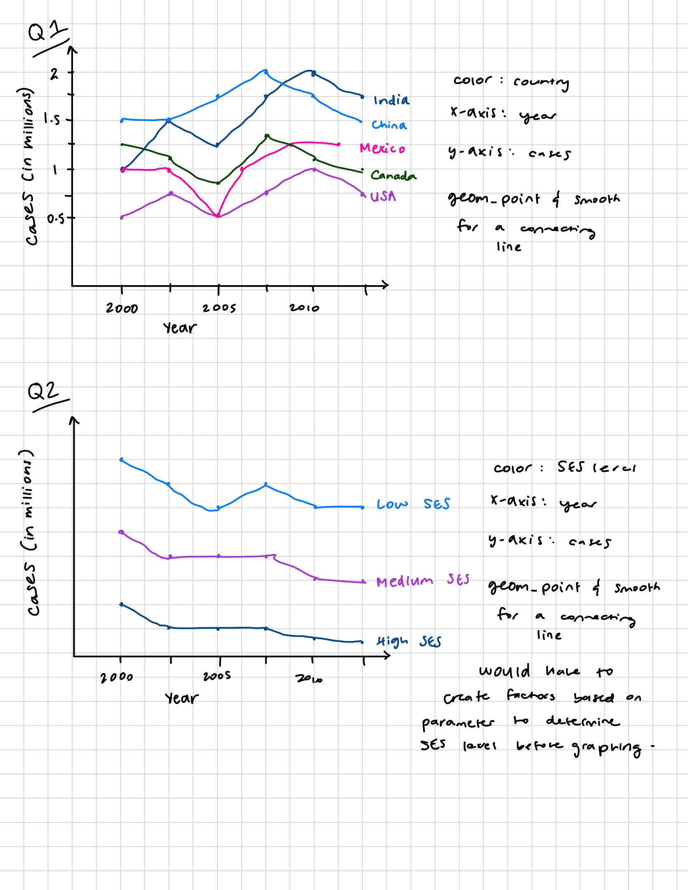

## Measles Data Set

**Meghana Kolar- Project 1 Checkpoint 1**

**Description of the data:**

My data set is the Measles data set. This data comes from the WHO, and contains information about provisional monthly measles and rubella data from 2025. Some of the variables include suspected measles cases, their connection to rubella, and total cases. There are two different sets of data- one for cases by month, and one for cases by year.

**Cleaning:**

The cleaning that had to be done was cleaning variable names and fixing data types. They renamed rows from the cases_year data frame to better represent what it stood for, as well as turning some of the data from the cases_month data frame into numeric data. They also deleted the first row of data and made the data into a year level for the cases_year data frame.

**Research Questions:**

1.  How have measles cases changed over time by country, for the top 5 countries with measles cases?

    I would use the cases_year data frame to answer this question, looking at the year and region variables, as well as the measles cases variables.

2.  Is there a specific time of year where measles is the most prevalent?

    I would use the cases_month data frame to answer this question, looking at the measles cases variables, as well as the month variable.

**Other Research Questions with Supplemental Data:**

1.  How does the county's socioeconomic status affect the amount of measles cases throughout a year?

    I would look at the cases_month data frame, with more information about the county and socioeconomic status of that county, and then compare the amount of cases they get in a year to other counties.

2.  How do the vaccination rates in an area affect the amount of measles cases they get throughout a month?

    I would look at the cases_month data frame with more information about vaccination rates in the region that the person is located in to compare rates of measles across a month.

**Sketches of Visualizations:**

1.  How have measles cases changed over time by country, for the top 5 countries with measles cases?
2.  How does the county's socioeconomic status affect the amount of measles cases throughout a year? 
